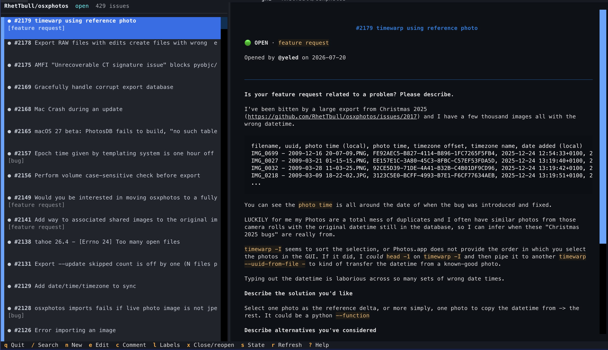

# ghi

`ghi` is a fast, lightweight terminal UI for using GitHub Issues as a development todo
list. It opens the repository connected to the current checkout by default and keeps the
common workflow on a single screen.



## Install and run

This project uses [uv](https://docs.astral.sh/uv/):

```console
uv sync
export GITHUB_ISSUE_ACCESS_TOKEN=github_pat_...
uv run ghi
```

If the current directory does not have a GitHub `origin`, or you want another repository:

```console
uv run ghi owner/repo
uv run ghi https://github.com/owner/repo
```

The token may also be passed with `--token` or entered at runtime with `t`. Runtime tokens
are held in memory only. For private repositories and write actions, use a fine-grained
personal access token with repository **Issues: read and write** permission. Public issues
can be viewed without a token, subject to GitHub's unauthenticated rate limit.

To install from Github:

```bash
uv tool install 'git+https://github.com/RhetTbull/ghi.git'
```

## Keys

| Key | Action |
| --- | --- |
| `j` / `k`, arrows | Next / previous issue |
| `Tab` / `Shift+Tab` | Switch between issue list and details |
| `Page Up` / `Page Down` | Scroll the issue body and comments |
| `/` | Search number, title, body, or labels |
| `n` | Create issue |
| `e` | Edit issue title, body, and labels |
| `c` | Add a comment |
| `l` | Set labels |
| `x` | Close or reopen issue |
| `s` | Cycle open, closed, and all issues |
| `r` | Refresh |
| `o` | Open issue in a browser |
| `g` | Change repository |
| `t` | Set an access token for this session |
| `?` | Built-in help |
| `q` | Quit |

Use `Ctrl+S` to save an issue editor and `Ctrl+Enter` to post a comment. `Esc` closes a
dialog or clears search. In search, `Enter` returns focus to the issue list while keeping
the active filter visible.

## Development

```console
uv run ruff check .
uv run pytest
```

## License

MIT
